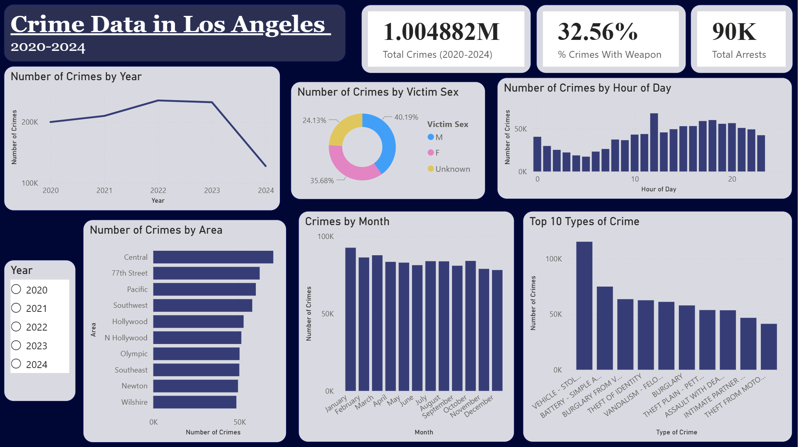

# Crime Data in Los Angeles (2020-2024)

## Overview
Analysis of over 1 million LAPD crime reports from 2020 to 2024. 
This project covers the full data analyst pipeline: data cleaning, 
SQL querying, and business intelligence visualization.

## Tools Used
- **Python (pandas)** — data cleaning and feature engineering
- **SQL (SQLite)** — querying and aggregating the dataset
- **Power BI** — interactive dashboard and visualizations

## Data Source
[LA Crime Data 2020-2024 — LA Open Data Portal][(https://data.lacity.org/Public-Safety/Crime-Data-from-2020-to-2024/2nrs-mtv8/about_data)](https://catalog.data.gov/dataset/crime-data-from-2020-to-present)]

## Key Findings
- Vehicle theft and battery were the most common crimes across all years
- Crime peaked in 2022 and has declined through 2024
- Central and 77th Street divisions had the highest crime volume and should 
  be prioritized for patrol resources and community intervention
- Summer months show slightly elevated crime, seasonal staffing adjustments 
  could help departments prepare accordingly
    - During the months of summer people are more likely to be outside which gives way to higher chances of crime
- Crime is highest between noon and 8PM (people are awake and at work/in public). Deploying additional units during 
  these hours in high-volume divisions could improve response times
- 32.56% of crimes involved a weapon
- Only ~90K arrests out of 1M crimes (~9% clearance rate)

## Dashboard Preview

## Repository Structure
- `notebook.ipynb` — data cleaning and feature engineering
- `crime_queries.sql` — SQL queries for analysis
- `dashboard.png` — Power BI dashboard screenshot
